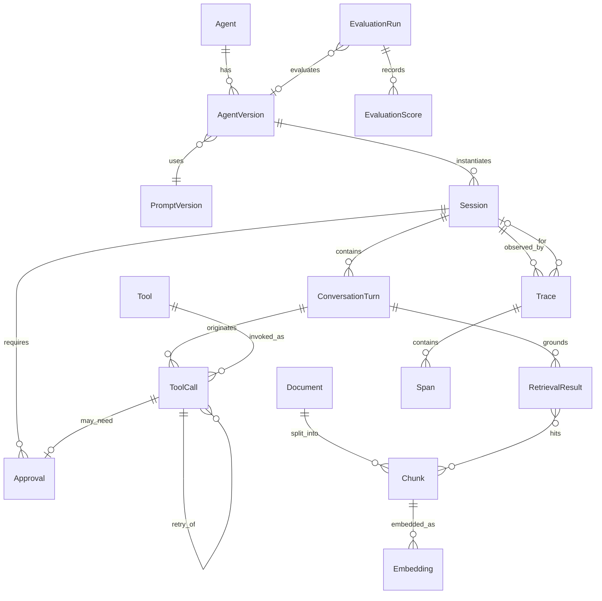

# Data Model Documentation

Canonical domain for AI agent systems. This is an architectural model, not an ORM schema and not a vendor data map.

Implementing projects may add bounded-context fields. They must not replace these aggregates with voice-provider or LLM-vendor objects as the system of record.

Related contracts: [api-spec.yml](./api-spec.yml), [backend-standards.md](./backend-standards.md).

## Design principles

1. **Explicit state** — sessions, tool attempts, and eval runs have named statuses.
2. **Versioning** — prompts, agents, embedding models, and chunkers are referenced by id + version on every turn.
3. **Auditability** — side effects point at a `ToolCall`; model output points at prompt and model versions.
4. **Source attribution** — retrieved chunks remain identifiable after generation.
5. **Separation of media and business state** — call/channel state is not the agent workflow state.
6. **Immutability of completed attempts** — retries create new `ToolCall` (or eval) rows.

Identifiers are UUIDs unless a project documents a different strategy. Timestamps are UTC.

## Model descriptions

### 1. Agent

A deployed conversational or workflow agent (voice, chat, or batch).

**Fields:**

- `id`: Primary key
- `name`: Stable human-readable name
- `channel`: `voice` | `chat` | `batch` | `multi`
- `status`: `draft` | `active` | `disabled`
- `createdAt`, `updatedAt`

**Relationships:** `versions` (AgentVersion)

### 2. AgentVersion

Immutable snapshot of policy for an agent.

**Fields:**

- `id`: Primary key
- `agentId`: FK Agent
- `version`: Monotonic or semver string
- `promptId`, `promptVersion`: FK-style reference to PromptVersion
- `modelId`, `modelVersion`: Opaque model identity used by the LLM adapter
- `allowedTools`: List of tool names or tool ids
- `maxToolHops`: Maximum sequential tool calls per turn
- `tokenBudget`, `latencyBudgetMs`, `costBudget`: Optional caps
- `hitlPolicy`: JSON policy (which risk classes require approval)
- `createdAt`

**Invariants:** Once referenced by a Session or Trace, an AgentVersion is immutable.

### 3. PromptVersion

Versioned instruction artifact.

**Fields:**

- `id` / `promptId` + `version`
- `role`: `system` | `developer` | `style` | `other`
- `contentRef`: Storage locator (file, table, or object store key) — not necessarily inline blob
- `hash`: Content hash for integrity
- `createdAt`

**Invariants:** Changing text always creates a new version. Production sessions store the version used, not "latest".

### 4. Session

One conversation, call, or workflow execution.

**Fields:**

- `id`: Primary key
- `agentVersionId`: FK AgentVersion
- `channel`: `voice` | `chat` | `batch`
- `externalChannelId`: Opaque id from the interaction adapter (call id, thread id). Not a vendor-typed payload
- `businessStatus`: Application workflow state (project-defined enum)
- `mediaStatus`: Optional channel media state (`idle` | `connecting` | `active` | `ended`)
- `startedAt`, `endedAt`
- `endReason`: `completed` | `transferred` | `failed` | `abandoned` | `error` | null
- `customerRef`: Optional external customer/account id

**Relationships:** ConversationTurns, ToolCalls, RetrievalResults (via turns), Approvals, Traces

**Invariants:** `businessStatus` and `mediaStatus` are independent. Ending media does not by itself close business wrap-up.

### 5. ConversationTurn

One user, assistant, system, or tool-facing turn.

**Fields:**

- `id`: Primary key
- `sessionId`: FK Session
- `index`: Order in the session
- `role`: `user` | `assistant` | `system` | `tool`
- `text`: Transcript or message (nullable if audio-only pending STT)
- `audioRef`: Optional locator for recordings
- `promptVersionId`: Prompt used to generate this turn (if assistant)
- `modelId`, `modelVersion`
- `tokenInput`, `tokenOutput`
- `latencyMs`
- `createdAt`

**Relationships:** ToolCalls originated in this turn; RetrievalResults used in this turn

### 6. CallState (value object / optional table)

Voice-specific media and turn-taking snapshot. Prefer embedding in Session + events if a separate table is unnecessary.

**Fields:**

- `sessionId`
- `turnTaking`: `agent` | `user` | `idle`
- `bargeInEnabled`: boolean
- `silenceMs`: Last measured silence
- `lastInterruptAt`: nullable

Do not store provider-native call objects here.

### 7. Tool

Catalog entry for a capability the runtime can execute (native, HTTP, MCP, or workflow trigger).

**Fields:**

- `id`: Primary key
- `name`: Namespaced unique name
- `riskClass`: `read` | `write` | `irreversible` | `external_comm`
- `schemaRef`: JSON Schema locator
- `timeoutMs`
- `source`: `native` | `mcp` | `http` | `workflow`
- `status`: `active` | `disabled`

### 8. ToolCall

One invocation attempt.

**Fields:**

- `id`: Primary key
- `sessionId`, `turnId`: FKs
- `toolId` / `toolName`
- `arguments`: JSON (validated)
- `result`: JSON (bounded, nullable until complete)
- `status`: `proposed` | `awaiting_approval` | `running` | `succeeded` | `failed` | `denied` | `timed_out`
- `errorCode`, `errorMessage`: nullable
- `attempt`: 1-based
- `parentToolCallId`: nullable, previous attempt
- `idempotencyKey`: nullable
- `startedAt`, `endedAt`
- `latencyMs`

**Invariants:** Completed rows are not mutated except for redaction. Retries insert a new row.

### 9. Approval (HITL)

**Fields:**

- `id`: Primary key
- `sessionId`, `toolCallId`
- `status`: `pending` | `approved` | `rejected` | `expired`
- `proposedAction`: Summary + arguments snapshot
- `actorId`: Human or system that decided
- `decidedAt`
- `reason`: nullable

### 10. Document

Source item in a knowledge corpus.

**Fields:**

- `id`: Primary key
- `corpusId`: Logical collection
- `sourceUri`
- `title`: nullable
- `mimeType`
- `sensitivity`: `public` | `internal` | `restricted`
- `sourceUpdatedAt`, `indexedAt`
- `parserVersion`
- `acl`: Optional JSON policy
- `status`: `active` | `stale` | `deleted`

### 11. Chunk

**Fields:**

- `id`: Primary key
- `documentId`: FK Document
- `locator`: Page, section, or char range
- `text`
- `tokenCount`
- `chunkerVersion`
- `metadata`: JSON (language, headings, etc.)

### 12. Embedding

**Fields:**

- `id`: Primary key
- `chunkId`: FK Chunk
- `modelId`, `modelVersion`
- `vector`: pgvector
- `createdAt`

**Invariants:** A chunk may have embeddings for more than one model version during migration. Queries must specify the model.

### 13. RetrievalResult

What was actually sent (or considered) for a turn.

**Fields:**

- `id`: Primary key
- `turnId`: FK ConversationTurn
- `queryText`
- `corpusVersion`
- `hits`: List of `{ chunkId, score, rank }`
- `threshold`, `retrieverVersion`, `rerankerVersion`: nullable
- `createdAt`

### 14. EvaluationRun

**Fields:**

- `id`: Primary key
- `suiteName`
- `datasetVersion`
- `agentVersionId`: nullable
- `promptVersionId`: nullable
- `status`: `running` | `passed` | `failed` | `error`
- `startedAt`, `endedAt`
- `gate`: `ci` | `openspec` | `nightly` | `manual`

**Relationships:** EvaluationScores

### 15. EvaluationScore

**Fields:**

- `id`: Primary key
- `evaluationRunId`
- `caseId`
- `metric`: e.g. `tool_schema_ok`, `groundedness`, `retrieval_recall_at_k`, `latency_p95`
- `value`: numeric
- `pass`: boolean
- `notes`: nullable

### 16. Trace and Span

Observability records. May be dual-written to an observability backend.

**Trace fields:**

- `id` (also used as external trace id)
- `sessionId`, `turnId`: nullable
- `startedAt`, `endedAt`
- `status`: `ok` | `error`

**Span fields:**

- `id`, `traceId`
- `kind`: `llm` | `tool` | `retrieval` | `http` | `workflow` | `voice`
- `name`
- `parentSpanId`: nullable
- `inputRef`, `outputRef`: Redacted payloads or locators
- `tokenInput`, `tokenOutput`: nullable
- `cost`: nullable numeric
- `latencyMs`
- `error`: nullable
- `retryCount`: default 0
- `evalScoreRef`: optional link to EvaluationScore

### 17. CostRecord (optional explicit table)

If cost is not stored only on spans:

- `id`, `traceId` or `turnId`
- `amount`, `currency`
- `component`: `llm` | `embed` | `stt` | `tts` | `other`

## Entity relationship diagram

## Mapping notes

- **Vapi / voice providers:** map call ids to `Session.externalChannelId`. Persist transcripts as `ConversationTurn`. Do not use the provider object as AgentVersion.
- **LangGraph / orchestrators:** graph node names may appear on Spans; session business state remains in `Session.businessStatus`.
- **Langfuse / observability:** export Trace/Span; PostgreSQL remains authoritative for sessions, tools, and HITL.
- **n8n:** workflow runs are ToolCalls or Spans with `kind = workflow`.
- **MCP:** runtime tools are rows in `Tool` with `source = mcp`.

## What this model is not

- Not a recruiting ATS (candidates, positions, interviews)
- Not a copy of a vendor assistant JSON
- Not a requirement to materialize every entity on day one; start with Session, Turn, ToolCall, and Trace, then add RAG and eval tables when those capabilities exist
